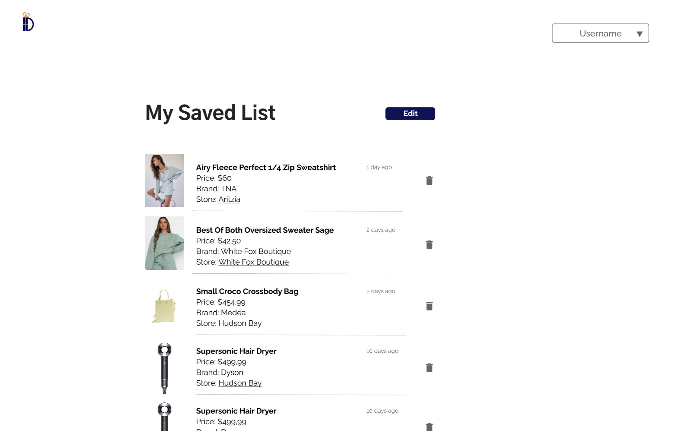

# Personal Shopping Web App

## Prerequisite

- Create config/default.json
- example configuration:

```
{
  "port": 5000,
  "mongoURI": YOUR_MONGO_URI,
}
```


## Run back-end
- `yarn start`

## Run front-end
- `cd client`
- `yarn start`

  
